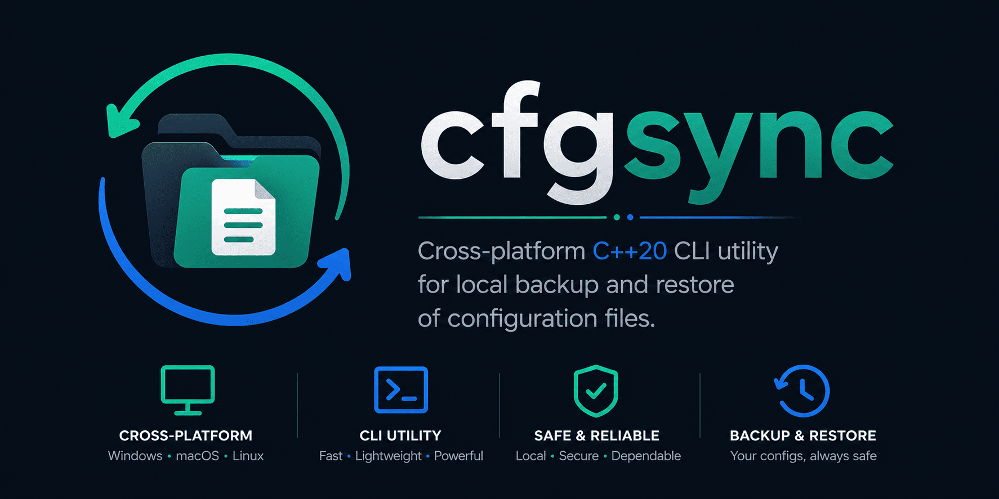

# cfgsync



`cfgsync` is a small cross-platform CLI utility for backing up and restoring text-based configuration files.

It is designed for a simple, local workflow: track important config files, save copies into a dedicated storage directory, and restore them later after a reinstall, migration, or accidental loss.

This project is not a Git replacement. It focuses on local configuration synchronization and recovery with a clean, minimal MVP.

## What It Does

- Tracks selected config files
- Stores backups in a readable local storage layout
- Restores saved files back to their original locations
- Keeps the workflow terminal-first and cross-platform

## MVP Commands

```bash
cfgsync init --storage <dir>
cfgsync add <file>
cfgsync remove <file>
cfgsync list
cfgsync backup
cfgsync restore --all
cfgsync restore <file>
```

## Scope

The current version targets ordinary files only and keeps the first iteration intentionally small.

Not part of the MVP:

- automatic file watching
- snapshot history
- diff support
- merge or conflict handling
- remote sync
- encryption
- directory tracking
- symlink tracking

## Platforms

`cfgsync` is being built with cross-platform support in mind for:

- Linux
- macOS
- Windows

## Tech

`cfgsync` is implemented as a modern, portable C++ command-line application.

- **Language:** C++20 with the standard library, including `std::filesystem` for cross-platform path and file operations.
- **Build system:** CMake, with an explicit `cfgsync` executable target and CTest integration.
- **Dependency management:** CMake `FetchContent` is used to retrieve project dependencies during configuration.
- **CLI parsing:** CLI11 provides the command structure and argument parsing.
- **JSON:** nlohmann/json is used for readable registry and app configuration files.
- **Logging:** spdlog provides structured command output and diagnostics.
- **Formatting:** fmt is used directly and as the external formatting backend for spdlog.
- **Testing:** GoogleTest is used for unit tests, currently focused on app configuration and platform-aware path behavior.
- **Static analysis:** optional clang-tidy support can be enabled with `CFGSYNC_ENABLE_CLANG_TIDY`, and SonarQube is used as an additional code quality analyzer.
- **Continuous integration:** GitHub Actions builds and runs tests across Windows, Linux with GCC, Linux with Clang, and macOS.

## Status

The project is currently in early MVP development.
